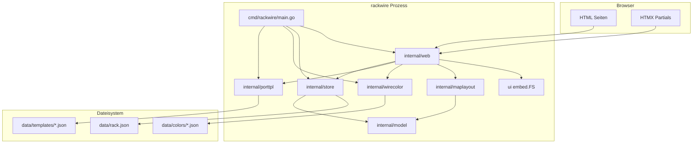

# rackwire — Entwicklerdokumentation

Zielgruppe: Du kennst Go schon etwas (Pakete, Structs, Interfaces, Fehlerbehandlung), hast aber noch keine Webanwendung mit der Standardbibliothek geschrieben und möchtest die „Feinheiten“ in diesem Projekt nachvollziehen.

Dieses Dokument erklärt Architektur, Verzeichnisstruktur und jede relevante Quelltextdatei — inklusive Hintergrund zu HTTP-Server, Routing und HTML-Antworten.

---

## Inhaltsverzeichnis

1. [Architektur-Übersicht](#1-architektur-übersicht)
2. [Verzeichnisstruktur](#2-verzeichnisstruktur)
3. [Anwendungsfluss beim Start](#3-anwendungsfluss-beim-start)
4. [Web in Go: Server, Routen, Antworten](#4-web-in-go-server-routen-antworten)
5. [Datenmodell und Persistenz](#5-datenmodell-und-persistenz)
6. [Quelltextdateien im Detail](#6-quelltextdateien-im-detail)
7. [UI, HTMX und Frontend-Assets](#7-ui-htmx-und-frontend-assets)
8. [Build, Docker und Makefile](#8-build-docker-und-makefile)
9. [Weiterlesen / Übungen](#9-weiterlesen--übungen)

---

## 1. Architektur-Übersicht

rackwire ist eine **klassische Server-Side-Rendered-Webapp** ohne separates Frontend-Framework und **ohne externe Go-Abhängigkeiten**. Alles läuft über die Standardbibliothek (`net/http`, `html/template`, `encoding/json`, …).



### Schichten (von außen nach innen)

| Schicht | Paket | Aufgabe |
|--------|--------|---------|
| Einstieg | `cmd/rackwire` | Env lesen, Abhängigkeiten verdrahten, HTTP-Server starten |
| HTTP/UI | `internal/web` | Routen, Formulare, Templates rendern |
| Domäne | `internal/model` | Structs für Rack, Geräte, Ports, Links, Räume |
| Persistenz | `internal/store` | Laden/Speichern von `rack.json` unter Mutex |
| Kataloge | `internal/porttpl`, `internal/wirecolor` | JSON-Dateien für Port-Templates und Aderfarben |
| Layout | `internal/maplayout` | Geometrie für die Verbindungskarte (SVG) |
| Assets | `ui` | HTML/CSS/JS per `embed` in die Binary |

### Designentscheidungen (kurz)

- **Ein Prozess, ein JSON-Dokument** für den Rack-Zustand — einfach zu backupen (`make backup`) und zu debuggen.
- **Templates und Farben separat** als Dateikataloge — erweiterbar ohne Codeänderung.
- **SSR + HTMX** statt SPA: der Server liefert HTML; nur der Port-Editor aktualisiert Partials per HTMX.
- **`internal/…`**: Pakete unter `internal` können von anderen Modulen außerhalb dieses Repos **nicht** importiert werden (Go-Compiler-Regel). So bleibt die öffentliche API klein (praktisch nur das Binary).

---

## 2. Verzeichnisstruktur

```
rackwire/
├── cmd/rackwire/main.go       # main()-Funktion, Server-Start
├── internal/
│   ├── model/                 # Domänen-Typen + Hilfsmethoden
│   ├── store/                 # Mutex + atomare JSON-Writes
│   ├── porttpl/               # Port-Template-Katalog
│   ├── wirecolor/             # Aderfarben-Paletten
│   ├── maplayout/             # Karten-Layout (Koordinaten, Bézier)
│   └── web/handlers.go        # gesamter HTTP-Layer
├── ui/
│   ├── fs.go                  # //go:embed
│   ├── layouts/               # komplette HTML-Seiten
│   ├── partials/              # wiederverwendbare Template-Stücke
│   └── static/                # CSS, app.js, htmx.min.js
├── data/
│   ├── rack.json              # persistierter Rack-Zustand
│   ├── templates/*.json       # Pinouts (T568A, Klingel, …)
│   └── colors/*.json          # Farbsammlungen (IEC 60757 + Streifen)
├── Dockerfile
├── docker-compose.yml
├── Makefile
└── docs/ENTWICKLER.md         # diese Datei
```

Konvention: Go-Code unter `cmd/` und `internal/`, Laufzeitdaten unter `data/`, UI unter `ui/`.

---

## 3. Anwendungsfluss beim Start

Alles beginnt in [`cmd/rackwire/main.go`](../cmd/rackwire/main.go):

```go
addr := env("ADDR", ":3040")
dataPath := env("DATA_PATH", "data/rack.json")
// TEMPLATES_DIR / COLORS_DIR defaulten neben DATA_PATH

cat, err := porttpl.Open(templatesDir)
colors, err := wirecolor.Open(colorsDir)
st, err := store.New(dataPath, cat)
srv, err := web.New(st, cat, colors, ui.Content)

log.Fatal(http.ListenAndServe(addr, srv.Handler()))
```

### Was passiert der Reihe nach?

1. **Umgebungsvariablen** mit Fallback (`env`-Hilfsfunktion).
2. **Kataloge öffnen**: Verzeichnisse anlegen, fehlende Seed-JSON schreiben, Dateien einlesen.
3. **Store öffnen**: `rack.json` laden oder Demo-Rack seeden.
4. **Web-Server bauen**: Templates aus dem Embed-FS parsen, Static-FS vorbereiten.
5. **`ListenAndServe`**: TCP-Socket binden und Requests an den `http.Handler` geben.

### Adresse `:3040` vs. `127.0.0.1:3040`

- `:3040` bedeutet „auf **allen** Interfaces Port 3040“ (`0.0.0.0:3040`).
- Unter WSL kann Windows den Port zusätzlich nur auf localhost weiterleiten — das ist ein OS-/WSL-Thema, kein Go-Bug.

### `log.Fatal(...)`

`ListenAndServe` blockiert normalerweise für immer. Es kehrt nur bei Fehler zurück (z. B. Port belegt). `log.Fatal` loggt und beendet den Prozess mit Exit-Code ≠ 0.

---

## 4. Web in Go: Server, Routen, Antworten

Wenn du bisher nur CLI-Tools in Go geschrieben hast, ist dieser Abschnitt der wichtigste.

### 4.1 Das zentrale Interface: `http.Handler`

```go
type Handler interface {
    ServeHTTP(ResponseWriter, *Request)
}
```

Alles, was HTTP bedient, implementiert im Kern diese eine Methode. Funktionen können mit `http.HandlerFunc` dazu gemacht werden:

```go
mux.HandleFunc("GET /map", s.mapPage) // mapPage hat Signatur (http.ResponseWriter, *http.Request)
```

### 4.2 `http.ServeMux` (Go 1.22+)

Früher matchte der Mux nur Pfade, Methode war manuell. Seit Go 1.22 kannst du **Methode + Pattern** registrieren:

```go
mux.HandleFunc("GET /devices/{id}", s.device)
mux.HandleFunc("POST /devices/{id}", s.updateDevice)
```

Pfadparameter liest du mit:

```go
id := r.PathValue("id")
```

Besonderheit: `GET /{$}` matcht **nur** die Root-URL `/`, nicht `/foo`. Ohne `{$}` würde `/` oft als Präfix zu breit matchen.

### 4.3 Request → Antwort (typischer Handler)

```go
func (s *Server) device(w http.ResponseWriter, r *http.Request) {
    id := r.PathValue("id")
    rack := s.store.Get()
    dev := rack.DeviceByID(id)
    if dev == nil {
        http.NotFound(w, r)
        return
    }
    s.render(w, "device.html", pageData{ /* ... */ })
}
```

Ablauf:

1. Parameter / Formular parsen (`r.ParseForm()`, `r.FormValue("name")`).
2. Domäne lesen oder unter `store.Update` ändern.
3. Entweder **HTML rendern** oder **Redirect** (`http.Redirect(..., 303)`).

### 4.4 HTML mit `html/template`

Go’s `html/template` escaped standardmäßig Inhalt gegen XSS (`<` wird zu `&lt;` usw.).

In rackwire:

1. Beim Start: `template.New("").Funcs(...).ParseFS(uiFS, "layouts/*.html", "partials/*.html")`.
2. Pro Antwort: `tmpl.ExecuteTemplate(w, "home.html", data)`.

Templates nutzen `{{define "home.html"}}` … `{{end}}` und können andere Templates einbinden:

```html
{{template "top" .}}
...
{{template "bottom" .}}
```

`top`/`bottom` liegen in `ui/partials/shell.html` (Nav, CSS, Scripts).

#### FuncMap — eigene Template-Funktionen

Manche Logik gehört nicht in HTML. Deshalb registriert `web.New` Hilfsfunktionen:

| Name | Zweck |
|------|--------|
| `kindLabel` | `patchpanel` → „Patchpanel“ |
| `wireSwatch` | Farbcode → Daten für CSS-Swatch |
| `colorKnown` | existiert der Code in der Palette? |
| `add` | einfaches Addieren in Templates |

Aufruf im Template: `{{wireSwatch $p.Color}}`.

#### `template.JS` und JSON im HTML

Wenn du JSON in ein `<script>` schreibst und dabei `printf "%q"` im Template nutzt, escaped `html/template` die Anführungszeichen **nochmals**. Ergebnis: Port-Labels erscheinen als `"A-01"` inklusive Anführungszeichen.

Deshalb baut der Handler JSON mit `encoding/json` und übergibt es als `template.JS` (vertrauenswürdiger Typ, der nicht nochmals „kaputtescaped“ wird):

```go
PortMapJSON: portMapJSON(&rack) // type template.JS
```

```html
<script type="application/json" id="port-map">{{.PortMapJSON}}</script>
```

### 4.5 Formulare: POST → Redirect → GET

Die meisten Aktionen folgen dem **PRG-Pattern** (Post/Redirect/Get):

1. Browser `POST /devices`
2. Server speichert und antwortet `303 See Other` auf `/`
3. Browser `GET /` — kein erneutes POSTen beim Reload

### 4.6 HTMX (nur Port-Editor)

HTMX sendet AJAX-Requests und tauscht HTML-Fragmente aus. Der Port-Editor:

```html
hx-post="/devices/.../ports/..."
hx-target="#port-editor"
hx-swap="outerHTML"
```

Der Server erkennt HTMX am Header `HX-Request: true` und liefert dann nur das Partial `port_editor.html` statt einer ganzen Seite + Redirect.

---

## 5. Datenmodell und Persistenz

### 5.1 Domäne (`model.Rack`)

Vereinfacht:

```text
Rack
 ├── Rooms[]      (id, name)
 ├── Devices[]
 │    ├── RoomID, Position, Kind, Color
 │    └── Ports[]
 │         ├── Label, TemplateID
 │         └── Pins[] (Number, Signal, Color, ColorHex)
 └── Links[]      (A/B: DeviceID + PortID)
```

`Color` am Pin ist der **Palette-Code** (`WH/OR`), `ColorHex` ein abgeleiteter Anzeigewert (bei Streifen oft die Basisfarbe).

### 5.2 Store: Mutex + Clone + atomares Schreiben

`internal/store` hält **ein** `model.Rack` im Speicher.

- **`Get()`**: liefert eine **Kopie** (JSON-Marshal/Unmarshal). So kann ein Handler die Kopie nicht „heimlich“ den Shared State kaputtmachen.
- **`Update(fn)`**: sperrt Mutex, ruft `fn(*Rack)` auf dem echten Objekt auf, speichert bei Erfolg.

Atomares Speichern:

```go
os.WriteFile(path+".tmp", data, 0644)
os.Rename(path+".tmp", path)
```

`Rename` auf demselben Dateisystem ist atomar: entweder alte oder neue Datei, kein halbes JSON bei Absturz mitten im Write.

### 5.3 Kataloge vs. Rack-Dokument

| Daten | Ort | Wer verwaltet |
|-------|-----|----------------|
| Geräte, Links, Räume | `data/rack.json` | `store` |
| Port-Pinouts | `data/templates/*.json` | `porttpl.Catalog` |
| Aderfarben | `data/colors/*.json` | `wirecolor.Catalog` |

Beide Kataloge **seeden** fehlende Dateien beim ersten Start, überschreiben bestehende Dateien aber nicht.

---

## 6. Quelltextdateien im Detail

### 6.1 `cmd/rackwire/main.go`

**Inhalt:** Einstiegspunkt des Binaries.

**Funktionen:**

| Name | Rolle |
|------|--------|
| `main` | Env, Open-Aufrufe, `ListenAndServe` |
| `env` | `os.Getenv` mit Default |

**Fortgeschritten / wichtig:**

- Dependency Injection „von Hand“: Catalogues und Store werden erzeugt und in `web.New` gesteckt — kein DI-Framework.
- `filepath.Dir(dataPath)` leitet die Defaults für Templates/Colors vom Datenfile ab; in Docker zeigt alles auf `/app/data/...`.

---

### 6.2 `ui/fs.go`

**Inhalt:** Einbettung der UI in die Binary.

```go
//go:embed layouts/* partials/* static/*
var Content embed.FS
```

**Fortgeschritten:**

- `//go:embed` ist eine Compiler-Direktive. Zur Build-Zeit werden die Dateien in das Binary kopiert.
- `embed.FS` implementiert `fs.FS` — dieselbe Schnittstelle wie ein echtes Dateisystem. Deshalb kann `template.ParseFS` und `http.FileServerFS` damit arbeiten.
- Vorteil: ein einziges Binary reicht für Produktion; Nachteil: UI-Änderungen brauchen Rebuild (kein Hot-Reload der Templates aus dem Disk im Default-Setup).

---

### 6.3 `internal/model/model.go`

**Inhalt:** Reine Domänentypen und Abfrage-/Sortierhilfen — kein HTTP, kein I/O.

**Wichtige Typen:** `Pin`, `Port`, `PortTemplate`, `Device`, `Room`, `Link`, `Endpoint`, `Rack`, `RoomGroup`.

**Wichtige Methoden:**

| Methode | Zweck |
|---------|--------|
| `DeviceByID` / `RoomByID` / `PortByID` | Lookup; liefert Pointer in den Slice (Mutation möglich) |
| `DevicesSorted` / `RoomsSorted` | Kopie, sortiert |
| `DevicesGroupedByRoom` | Gruppen für die Startseite |
| `ClearRoomID` | nach Raum-Löschen Referenzen leeren |
| `LinkForPort` / `PeerLabel` / `EndpointLabel` | Patchkabel-Beschriftung |

**Fortgeschritten:**

- **Pointer in Slice-Elemente:** `DeviceByID` gibt `&r.Devices[i]` zurück. Änderungen an `dev.Name` ändern den Eintrag im Slice. Das ist beabsichtigt in `store.Update`. Nach `Get()` (Clone) ist das ungefährlich für den Shared State.
- **`sort.SliceStable`:** stabile Sortierung — bei gleichem `Position`-Wert bleibt die relative Reihenfolge nach Name erhalten.
- **JSON-Tags** (`json:"roomId,omitempty"`): steuern Serialisierung; `omitempty` lässt leere Strings weg.

---

### 6.4 `internal/model/model_test.go`

**Inhalt:** Blackbox-Tests (`package model_test`).

**Tests:** Sortierung nach Position; Raum-Gruppierung inkl. „Ohne Raum“ und ungültiger `roomId`.

**Hinweis:** External-Test-Paket importiert `model` wie ein anderer Client — gut, um nur die öffentliche API zu testen.

---

### 6.5 `internal/store/store.go`

**Inhalt:** Persistenzschicht für `rack.json`.

**API:**

| Symbol | Zweck |
|--------|--------|
| `New` | laden oder seeden |
| `Get` | geklonter Snapshot |
| `Update` | mutieren + speichern |

**Unexported:** `loadOrSeed`, `saveLocked`, `cloneRack`, `seedRack`, `sequentialID`.

**Fortgeschritten:**

- **`sync.Mutex`:** alle Zugriffe serialisieren. Go-Webserver bedient Requests parallel in Goroutinen — ohne Lock gäbe es Data Races.
- **Deep Clone über JSON:** pragmatisch und korrekt für diesen Datengraphen; etwas CPU-lastiger als handgeschriebenes Kopieren, hier vernachlässigbar.
- **Filter-Idiom beim Löschen:** `out := rack.Devices[:0]` behält die zugrunde liegende Array-Kapazität und hängt behaltene Elemente neu an (weniger Allokationen).

---

### 6.6 `internal/porttpl/catalog.go`

**Inhalt:** Dateibasierter Katalog für Port-Templates.

**Konstante:** `DefaultID = "rj45-t568a"`.

**API (Auswahl):** `Open`, `List`, `ByID`, `ApplyTemplate`, `NewPorts`, `Save`, `Delete`, `IsSeed`, `Slug`.

**Fortgeschritten:**

- **`sync.RWMutex`:** viele Leser (`RLock`) können parallel, Schreiber exklusiv — sinnvoll, weil Templates oft nur gelesen werden.
- **Seed-on-Open:** `ensureSeeds` schreibt Built-ins nur, wenn die Datei fehlt.
- **`ApplyTemplate`:** kopiert Pins vom Template auf den Port und setzt `TemplateID`.
- **`Slug`:** Anzeigename → Dateiname/`id` (Kleinbuchstaben, nicht-alphanumerisch → `-`).
- Seed-Templates sind **nicht löschbar** (`IsSeed` / `Delete`).

---

### 6.7 `internal/porttpl/catalog_test.go`

**Inhalt:** TempDir-Test: Seeds entstehen, Speichern eigener Templates funktioniert.

---

### 6.8 `internal/wirecolor/catalog.go`

**Inhalt:** Farbsammlungen; Auflösung einfarbig vs. Wechselfarbig (`base` + `stripe`).

**Typen:** `Entry`, `Palette`, `Resolved`, `SelectOption`, `Catalog`.

**API:** `Open`, `Resolve`, `Known`, `Options`, `GroupedOptions`, `ListPalettes`.

**Fortgeschritten — Zwei-Pass-Laden:**

1. Alle soliden Farben (`hex` gesetzt) in eine Map `id → hex`.
2. Streifen-Einträge (`WH/OR`) referenzieren `base`/`stripe` und bekommen `BaseHex`/`StripeHex`.

UI rendert Streifen per CSS (`repeating-linear-gradient` mit CSS-Variablen `--base` / `--stripe`).

`Resolve("UNBEKANNT")` liefert einen grauen Fallback — alte Freitext-Codes brechen die UI nicht.

---

### 6.9 `internal/wirecolor/catalog_test.go`

**Inhalt:** Solid/Stripe/Unknown/Known/GroupedOptions gegen TempDir-Seed.

---

### 6.10 `internal/maplayout/layout.go`

**Inhalt:** Reine Berechnungsbibliothek für die Verbindungskarte — kein HTTP.

**Typen:** `Diagram`, `Column`, `PortView`, `Curve`.

**Einstieg:** `Build(rack *model.Rack) Diagram`.

**Logik:**

- Links: `patchpanel` und `router`.
- Rechts: übrige Geräte (Dosen, …).
- Pro Gerät eine Spalte; Ports als Zeilen mit Y-Koordinaten.
- Links werden als kubische Bézier-Kurven (`SVG path` mit `C`) gezeichnet.

**Fortgeschritten:** Trennung von Layout und Rendering — `Build` kennt kein HTML; das Template `map.html` zeichnet nur noch SVG aus den Zahlen.

---

### 6.11 `internal/maplayout/layout_test.go`

**Inhalt:** Prüft grob, dass Rack-Geräte links und Feld-Geräte rechts landen.

---

### 6.12 `internal/web/handlers.go`

**Inhalt:** Gesamter HTTP-Layer (ein großes File — bewusst einfach gehalten).

#### Konstruktion

`web.New(store, porttpl, wirecolor, uiFS)`:

1. FuncMap registrieren.
2. Templates parsen.
3. `fs.Sub(uiFS, "static")` für `/static/`.

#### `Handler() http.Handler`

Baut den `ServeMux` und gibt ihn zurück. `main` steckt ihn in `ListenAndServe`.

#### Handler-Gruppen

| Bereich | Beispiele |
|---------|-----------|
| Health | `GET /api/health` → JSON |
| Home/Map | `home`, `mapPage` |
| Geräte | create/update/delete, Ports hinzufügen |
| Ports | Anzeige, Preview ohne Speichern, Update inkl. HTMX |
| Links | create/delete |
| Templates | CRUD auf Katalog-Dateien |
| Farben | Read-only Übersicht |
| Räume | CRUD in `rack.json` |

#### Hilfsfunktionen

| Name | Zweck |
|------|--------|
| `render` | `ExecuteTemplate` + Content-Type |
| `withColors` | ColorGroups/Palettes in `pageData` |
| `portMapJSON` | Geräte→Ports für JS-Dropdowns |
| `parsePinsFromForm` | `pin_0_color` … aus dem Formular; Hex aus Palette |
| `newID` | `crypto/rand` → `id_` + Hex |
| `defaultPortPrefix` / `inferPortPrefix` | `P-` / aus bestehendem Label |
| `previewPort` | Template anwenden **ohne** `store.Update` |

**Fortgeschritten:**

- **`pageData`:** ein Struct für alle Template-Variablen (statt `map[string]any`) — typsicherer und in Templates klarer.
- **Intent-Multiplexing:** ein POST-Endpoint, Feld `intent` unterscheidet Speichern, Pin hinzufügen, als Template speichern, …
- **Preview vs. Save:** Template-Wechsel im Editor lädt Pins per GET `/preview` (nur Anzeige); Persistenz erst bei Speichern.
- **IDs:** kryptographisch zufällig genug für lokale Apps; nicht als Sicherheits-Secret gedacht.

---

## 7. UI, HTMX und Frontend-Assets

### Templates

| Datei | Rolle |
|-------|--------|
| `layouts/home.html` | Startseite: Geräte, Anlegen, Verbindungen (aufklappbar) |
| `layouts/device.html` | Gerät + Ports |
| `layouts/port.html` | Port-Seite inkl. Editor |
| `layouts/map.html` | Verbindungskarte |
| `layouts/templates.html` / `template_edit.html` | Template-Verwaltung |
| `layouts/colors.html` | Farbpalette |
| `layouts/rooms.html` | Raum-Verwaltung |
| `partials/shell.html` | HTML-Gerüst, Nav, Script-Includes |
| `partials/port_editor.html` | HTMX-Partial |
| `partials/wire_swatch.html` | Farbkästchen |
| `partials/map_column.html` | Gerätespalte auf der Karte |

### Static

- `app.css` — Layout, Swatches, Fold-Panels
- `app.js` — Port-Dropdowns auf der Home-Seite, Karten-Hover, Farb-Swatch-Live-Update, Panel-Zustand in `localStorage` (nur solange man auf der Home-Seite bleibt)
- `htmx.min.js` — HTMX-Bibliothek

### Aufklappbare Panels

`<details class="panel fold">` — rein HTML. Zustand: `localStorage`, Key `rackwire.home.folds`. Beim Besuch anderer Seiten wird der Key gelöscht (Defaults beim nächsten Home-Besuch).

---

## 8. Build, Docker und Makefile

```bash
make build          # → bin/rackwire
make run            # lokal mit data/
make up             # Docker Compose, bind-mount ./data
make backup         # backups/rackwire-YYYYMMDD-HHMMSS.zip
make test           # falls ergänzt; sonst: go test ./...
```

Empfohlen zum Lernen:

```bash
go test ./...
go run ./cmd/rackwire
```

**Compose** mountet `./data` nach `/app/data` — gleicher Speicher wie `make run`. Nicht beides gleichzeitig starten.

**Dockerfile:** Multi-Stage-Build, `CGO_ENABLED=0`, kleines Alpine-Image, Healthcheck auf `/api/health`.

---

## 9. Weiterlesen / Übungen

1. Setze einen Breakpoint (oder `log.Printf`) in `updatePort` und speichere einen Port per HTMX — beobachte `HX-Request`.
2. Lege unter `data/colors/` eine zweite Palette-JSON an und starte neu — sie erscheint in den Optgroups.
3. Ändere `maplayout.Build`, sodass die Spaltenreihenfolge anders ist — nur Geometrie, kein HTML.
4. Lies die Offizielle Doku: [net/http](https://pkg.go.dev/net/http), [html/template](https://pkg.go.dev/html/template), [embed](https://pkg.go.dev/embed).

---

## Glossar

| Begriff | Bedeutung hier |
|---------|----------------|
| SSR | Server rendert HTML |
| Partial | HTML-Fragment (HTMX-Swap) |
| Catalog | Dateiordner mit JSON-Definitionen im Speicher |
| Seed | Beim ersten Start mitgelieferte Beispieldaten |
| PRG | Post/Redirect/Get |
| Mutex | Gegenseitiger Ausschluss für Shared State |
| ServeMux | Go’s eingebaute Request-Multiplexer / Router |
